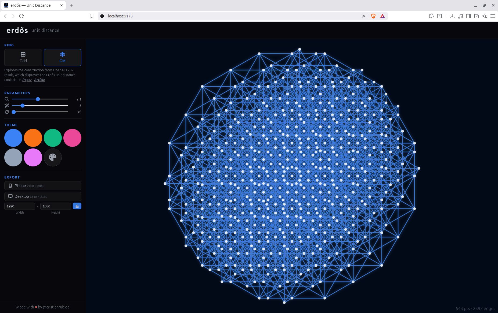

# erdős — unit distance


Interactive explorer for unit-distance graphs on two rings.



**Gauss** — classic Erdős construction (1946). Points on the Gaussian integer lattice; edges connect pairs at unit distance.

**CM** — construction from OpenAI's 2025 result that disproves the Erdős unit distance conjecture. [Paper](https://cdn.openai.com/pdf/74c24085-19b0-4534-9c90-465b8e29ad73/unit-distance-proof.pdf) · [Article](https://openai.com/index/model-disproves-discrete-geometry-conjecture/)

Adjust scale, glow, and rotation. Export as PNG (phone · desktop · custom).

## What you're seeing

In 1946, Paul Erdős asked a deceptively simple question: place *n* points on a plane — how many pairs of them can be at distance exactly 1 from each other? Every line you see in this app is one of those pairs: an edge drawn between two points exactly one unit apart.

**Grid (Gauss)** shows Erdős's original lower bound. Points sit on the integer lattice, and each point connects to its four immediate neighbors. As you raise *n*, watch the counter in the corner: points grow as *(2n+1)²*, while edges stay close to twice the point count — each interior point touches only four unit neighbors, and every edge is shared by two points. Erdős conjectured that no arrangement could do *fundamentally* better than a lattice like this.

**CM** shows why that conjecture is now false. In 2025, an OpenAI model found a construction based on a cyclotomic ring (complex numbers built from roots of unity) where each point participates in far more unit distances than any lattice allows. Switch to it and compare the stats: roughly the same number of points, but each one is far more connected — the visual density you see *is* the counterexample.

Things to try: rotate the Grid 45° to see the lattice diagonally; crank the scale on CM to see its layered, almost-crystalline internal structure; lower the glow to count edges at a single node by eye.

## Run

```bash
npm install
npm run dev
```

Then open `http://localhost:5173`.

Run the unit tests with `npm test`.
